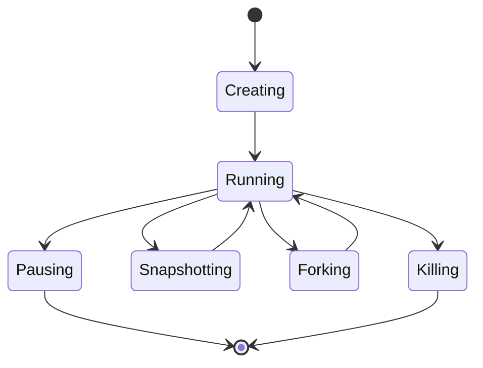
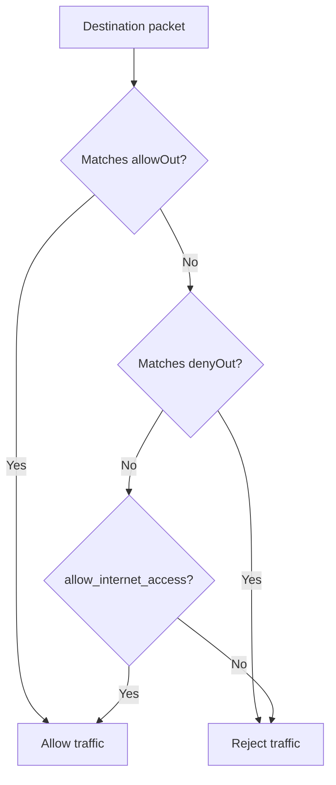

# Sandboxes

A sandbox is an isolated Firecracker microVM with its own Linux kernel, filesystem, and network stack. Each sandbox runs independently and can be paused, resumed, or deleted.

---

## Lifecycle



| State | Description |
|-------|-------------|
| **Creating** | VM is booting, block devices are being attached, networking is being configured |
| **Running** | VM is ready. Commands can be executed, proxy traffic is routed, timeout is ticking |
| **Pausing** | Memory and disk snapshots are being captured and published; the VM is then stopped and the running sandbox ceases to exist |
| **Snapshotting** | A persistent snapshot is being captured; sandbox returns to Running after |
| **Forking** | Sandbox is being cloned into child sandboxes; source returns to Running after |

A paused sandbox is not a state of a running sandbox. It is a row in the snapshot catalog — the sandbox's newest paused snapshot, carrying its configuration — and consumes no node resources. `GET /sandboxes/{id}` renders that row with state `paused`. Resuming is a create under the same sandbox ID from that row, so a resumed sandbox enters at `Creating` like any other.
| **Killing** | VM is being torn down and resources released |

---

## Starting a Sandbox

There are two ways to start a sandbox:

### Warm Start (from a template)

Starting from a pre-built template restores a snapshot of a known filesystem state.

```bash
aenv start <template-id>
```

See [Templates](./templates.md) for how templates are created.

### Cold Start (from an OCI image)

A cold start pulls an OCI image directly and converts it into a block device at runtime.

```bash
aenv start --cold ubuntu:24.04
```

The cold-start API accepts an optional `diskSizeMB` field to set the root filesystem's virtual size in MiB. Explicit values must be at least 1024 MiB and divisible by 1024 because the current resize tool operates at 1 GiB granularity. Growth is allowed by default; shrinking below the source image size requires `ublk.overlaybd.allow_shrink = true`. If omitted, the image's built-in virtual size is used. Resizing applies only when creating a fresh writable root filesystem, not to read-only images, images with an existing upper, or snapshot resume. Sandbox responses also report disk size as `diskSizeMB`.

Use `aenv start --secure` with either warm or cold starts to require an envd access token for command and file operations. The CLI obtains and sends the token automatically. Secure mode protects the envd control port only; it does not add authentication to application ports. Each fork derives a distinct envd token from the child sandbox ID.

---

## Working with Sandboxes

### Shell and command execution

```bash
# Attach to a sandbox
aenv connect <sandbox-id>

# Run a one-shot command and stream its output
aenv exec <sandbox-id> ls -la /
```

### Pause and Resume

Pausing a sandbox captures:
- **Memory snapshot** of the running VM state
- **Disk snapshot** of the writable filesystem layer

Resuming creates a new VM under the same sandbox ID from the newest paused snapshot — on the node that paused it when that node is schedulable, otherwise wherever placement decides. The sandbox picks up exactly where it left off, including running processes; its lifetime budget and the running time already charged carry over. The paused snapshot is kept until the sandbox is deleted, and the next pause writes a new one. Pausing an already-paused sandbox is a `409`; deleting a sandbox removes every paused snapshot of it.


```bash
aenv pause <sandbox-id>
aenv resume <sandbox-id>
```

### Persistent Snapshots

A snapshot captures the state of a **running** sandbox into a template that can be used to start new sandboxes.

```bash
aenv snapshot create <sandbox-id>
aenv snapshot create <sandbox-id> --name my-base
```

The resulting snapshot appears in `aenv snapshot list` and can be started with `aenv start <name>`. See [Snapshots](./snapshots.md) for details.

### Fork

Forking clones a **running** sandbox into up to 100 child sandboxes on the same node (`count`, 1-100). The source sandbox is briefly paused while the clone is captured, then resumes. All children inherit the source's filesystem, memory, and resource configuration.

```bash
curl -X POST \
  -H 'X-API-Key: test-key' \
  -H 'Content-Type: application/json' \
  -d '{"count": 3}' \
  http://127.0.0.1:8000/sandboxes/<sandbox-id>/fork
```

### Managing sandboxes

```bash
# List all sandboxes
aenv list

# Delete a sandbox
aenv delete <sandbox-id>
```

---

## Auto-Eviction

Every sandbox has a TTL (time-to-live). When it expires, one of two actions is taken:

- **pause** (default) — the sandbox is paused and its state is preserved
- **kill** — the sandbox is deleted permanently

Set TTL with `--timeout <secs>`:

```bash
# Start a sandbox with TTL of 600s
aenv start <template-id> -d --timeout 600

# Set the sandbox expiration for 600 seconds from now
aenv timeout <sandbox-id> 600
```

To delete instead of pause on expiry, use the API directly with `autoPause: false`:

```bash
curl -X POST \
  -H 'X-API-Key: test-key' \
  -H 'Content-Type: application/json' \
  -d '{"templateID": "<template-id>", "timeout": 600, "autoPause": false}' \
  http://127.0.0.1:8000/sandboxes
```

The default timeout is configured in `config/default.toml` under `[orchestrator].default_sandbox_timeout_secs`.

---

## Networking

Each sandbox runs in its own network namespace. By default, outbound internet access is enabled. To disable it at creation time:

```bash
curl -X POST \
  -H 'X-API-Key: test-key' \
  -H 'Content-Type: application/json' \
  -d '{"templateID": "my-ubuntu", "allow_internet_access": false}' \
  http://127.0.0.1:8000/sandboxes
```

For fine-grained egress control, pass a `network` object when creating the sandbox. Within user-configured egress rules, traffic is allow-by-default, and `allowOut` entries take precedence over matching `denyOut` entries. `allowOut` by itself does not create an allowlist: destinations that do not match a deny rule remain reachable.

- `allowOut` — CIDR or IP. Domain patterns are currently not supported.
- `denyOut` — CIDR or IP

The following diagram illustrates how the rules are evaluated:



`allowOut` is evaluated before `denyOut` in the user egress chain, so an allowed destination can override an overlapping user-configured deny rule. `allow_internet_access: false` sets the base policy to `Deny`, which appends a catch-all reject after those rules and makes the remaining destinations fail closed. Static internal-network deny rules are evaluated before the user egress chain and cannot be overridden by `allowOut`.

To create an allowlist, deny all traffic and then add the allowed exceptions with `allowOut`. You can deny all traffic explicitly with `denyOut: ["0.0.0.0/0"]`, or use `allow_internet_access: false` together with `allowOut`.

```bash
curl -X POST \
  -H 'X-API-Key: test-key' \
  -H 'Content-Type: application/json' \
  -d '{
    "templateID": "my-ubuntu",
    "network": {
      "allowOut": ["8.8.8.8/32", "1.1.1.1/32"],
      "denyOut": ["0.0.0.0/0"]
    }
  }' \
  http://127.0.0.1:8000/sandboxes
```

Egress rules can also be updated on a running sandbox:

```bash
curl -X PUT \
  -H 'X-API-Key: test-key' \
  -H 'Content-Type: application/json' \
  -d '{"allowOut": ["8.8.8.8/32"], "denyOut": ["0.0.0.0/0"]}' \
  http://127.0.0.1:8000/sandboxes/<sandbox-id>/network
```

Omitting both fields clears all per-sandbox egress rules and restores the default allow behavior.

---

## Data Storage

| Path | Contents | Config |
|------|----------|--------|
| `$AENV_HOME/snapshot-store/` | Committed snapshot and template artifacts (rootfs layers, memory snapshots, metadata) | `[backend.posix_fs].snapshot_store` |
| `$AENV_HOME/persisted-sandboxes/` | Scratch root for capture artifacts and node reclaim; nothing here survives a pause | `[orchestrator].persisted_sandbox_store_path` |
| `$AENV_HOME/image-cache/` | Converted OCI image layers (overlaybd format) cached after first cold start or template build | `[image.cache].root_dir` |
