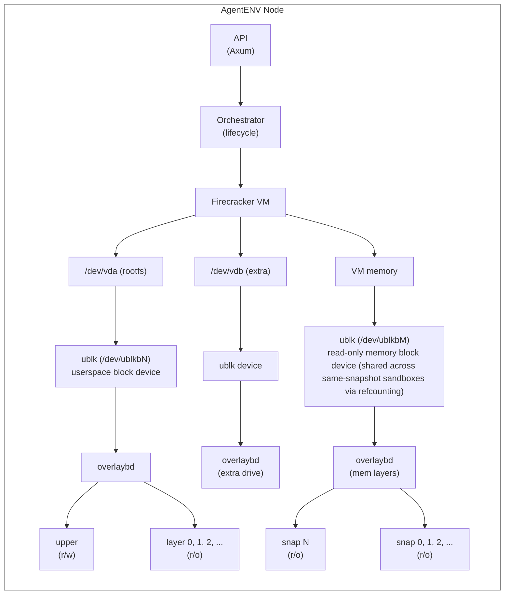
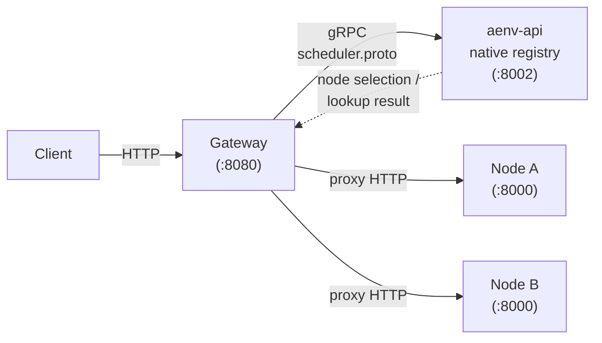

# AgentENV Architecture

AgentENV runs AI agents inside isolated, snapshot-capable Firecracker microVMs. Its core is a **storage subsystem** that provides layered block devices mountable into VMs and ublk-backed memory snapshot restore. The system also includes a per-node **orchestrator** managing sandbox lifecycle, and a **distributed control plane** for multi-node routing.

## System Overview



## Storage 

The storage subsystem turns layered image files into block devices mountable by VMs, and provides ublk-backed memory snapshot restore for snapshot resume. Four crates compose the active subsystem:

### overlaybd (`storage/overlaybd/`)

LSMT (Log Structured Merge Tree) based layered image format.

**Image structure**: Each layer file has a `HeaderTrailer` (magic `LSMT\0\1\2`, UUID, flags, index/data offsets) and an array of `DiskSegmentMapping` entries (16 bytes each, bit-packed: 50-bit offset, 14-bit length, 55-bit physical offset, zeroed flag, layer tag). Layers are stacked: immutable compressed read-only layers at the bottom, a single writable upper layer on top.

**Read path**: `ImageFile` resolves a read request by searching layers top-down via the segment index. The first layer containing a mapping for the requested block range serves the data. Unmapped ranges in upper layers fall through to lower layers.

**Write path**: All writes append to the upper layer. The upper layer's index is updated in memory and flushed on sync.

**Backends** (pluggable via `VirtualFile` trait):
- `LocalFile`: io_uring pread/pwrite with optional O_DIRECT
- `registryfs_v2`: OCI registry (remote layer download)
- `tar`: tar archive reading
- Optional cache layer for decompressed block caching

**Compression**: zstd (level 3) with random-access jump tables and CRC32C checksums.

**Snapshot**: `ImageFile::create_snapshot_and_restack()` is the primary pause path. It seals the live upper layer via `LSMTFile::close_seal_and_reopen()` so the upper becomes the newest lower layer, then reopens a fresh writable upper in place. `export_upper_as_sealed()` (`image/image_file.rs` / `lsmt/file/readwrite.rs`) has no production caller and is retained deliberately; its own doc comment says so.

**Key files**: `image/image_file.rs` (high-level image), `lsmt/file/` (LSMT stacking: `readonly.rs` for `LSMTReadOnlyFile`, `readwrite.rs` for `LSMTFile`, `stack.rs` for open/merge/stack helpers), `lsmt/format.rs` (binary format), `lsmt/index.rs` (segment mapping), `compression/zfile.rs` (compression), `image/snapshot.rs`.

### ublk (`storage/ublk/`)

Async userspace block device server using Linux's ublk kernel driver. Exposes OverlayBD images as `/dev/ublkbN` block devices.

**Device lifecycle**:
1. `UVMUblkCtrlBuilder` sends `ADD` to `/dev/ublk-control` via io_uring `UringCmd`
2. Kernel allocates device ID, creates `/dev/ublkcN` (control) and `/dev/ublkbN` (block)
3. Per-queue worker threads start, each with a thread-local `AsyncIoRing` and slab-allocated I/O slots
4. Kernel dispatches block I/O to mmap'd `ublksrv_io_desc` arrays; userspace processes them asynchronously
5. `delete_dev()` tears down the device

**Target implementation** (`UVMUblkTarget` trait):
- `OverlaybdTarget`: wraps `ImageFile` for full layered image I/O

**I/O buffers**: `AutoRegBuffer` (zero-copy via sparse buffer table, kernel 6.8+) or `UserBuffer` (traditional allocation).

**Key files**: `lib.rs` (public API), `ctrl.rs` (device controller), `dev.rs` (device + queue management), `queue.rs` (I/O descriptor handling), `io_buffer.rs`, `impls/overlaybd_target.rs`.

### ublk-daemon (`storage/ublk-daemon/`)

Long-running daemon process (`uvm-ublk-daemon`) that manages all ublk devices in one process and communicates with the AgentENV node over a Unix domain socket.

- Supports RPCs for OverlayBD runtime creation for sandbox rootfs/extra drives, raw OverlayBD device creation for non-runtime callers, warm-pool acquire/release, resize capability queries, restack snapshot, delete, and shutdown.
- `UblkDaemonClient` spawns and monitors the daemon process from the node runtime.
- `UblkDeviceManager` (`src/sandbox/ublk/device.rs`) is the node-facing singleton that delegates lifecycle operations to the daemon client; device IDs are allocated in the daemon.

This separation keeps ublk device ownership and io_uring control in a dedicated process while the node server orchestrates lifecycle state.

### storage-util (`storage/util/`)

Shared io_uring abstractions used by both ublk and overlaybd.

- `AsyncIoRing<S>`: generic async io_uring wrapper with slab-based `RingFuture` for CQE delivery. Supports standard (64B) and extended (128B) SQE types.
- `IoRingWorker`: spawns dedicated worker threads with thread-local io_uring instances. MPSC channel submission eliminates cross-thread locking.
- `ReloadableIDAllocator`: O(1) bitmap-based ID allocation/recycling with free list. Supports reloading pre-occupied IDs on restart.

### Sandbox integration (`src/sandbox/ublk/` + `src/sandbox/extra_drive.rs`)

- `device.rs`: owns the process-wide `UblkDeviceManager`, which talks to `uvm-ublk-daemon` and creates / deletes / snapshots all runtime ublk devices.
- `overlaybd.rs`: materializes runtime configs (rewrites paths, creates symlinks to layer files) for rootfs and attached drives.
- `extra_drive.rs`: prepares user-specified extra block drives with rollback on failure. Read-only and writable drives now follow the same per-sandbox device lifecycle; the only semantic difference is whether overlaybd materializes a writable upper.

### Memory Snapshot Restore

Memory snapshot restore uses ublk-backed overlaybd devices rather than userfaultfd. On resume, a read-only ublk device is created from the stacked memory overlaybd layers and passed to Firecracker as a `BackendType::File` memory backend. Firecracker mmaps the block device and COWs pages into anonymous memory on first write, so the underlying device is never modified.

**Sharing**: Multiple sandboxes booting from the same snapshot template share a single memory ublk device via reference counting. This allows the Linux page cache to be reused across all sandboxes using the same memory image, significantly reducing I/O for concurrent launches from the same template.

**Memory snapshot creation**: On pause, Firecracker creates a state-only diff snapshot. AgentENV queries Firecracker's dirty/present memory ranges, reads the selected memory with `process_vm_readv`, and directly creates the OverlayBD memory layer. Parent layers from previous snapshots are stacked, forming the full layered memory image.

## Per-Node Subsystems

Each node is an `aenv-node` binary (`crates/aenv-node/src/bin/aenv-node.rs`) on a Linux host
with `/dev/kvm` and one configured virtualization mode. KVM is the default;
PVM currently requires x86_64 and the `kvm_pvm` host module.

| Subsystem | Location | Responsibility |
|-----------|----------|---------------|
| API layer | `src/api/` | Axum HTTP server, OpenAPI endpoints, reverse proxy to sandbox services, node/admin APIs |
| Orchestrator | `src/orchestrator/` | Sandbox lifecycle state machine (Creating, Running, Forking, Snapshotting, Pausing, Killing), auto-eviction, incremental runtime metrics; a pause ends in a snapshot-catalog row and no record |
| Observability | `src/observability/` | Node identity, machine info, request-time host metrics collection, node snapshot projection for admin APIs, optional scheduler heartbeat reporting |
| Sandbox | `src/sandbox/` | Firecracker VM management, network namespaces, rootfs, envd communication, ublk devices (rootfs + memory), warm network/block/Firecracker pools |
| Snapshot + Template Builder | `src/snapshot/`, `src/template/` | `src/snapshot/` owns committed snapshot storage/runtime resolution; `src/template/` provides the user-facing builder that publishes snapshots |
| P2P artifact transport | `src/p2p/` | Optional project-wide artifact lookup, publish, and fetch layer with disabled and iroh-backed transports |
| Config | `src/cfg.rs` | TOML config for firecracker paths, machine specs, timeouts, shared pool tuning, observability metadata, P2P, and scheduler-report settings |

### Sandbox Networking

Sandbox networking is managed by a process-wide `NetworkManager` (`src/sandbox/network/manager.rs`) plus per-slot `Slot` objects (`src/sandbox/network/slot.rs`).

- Each slot owns a stable index-derived address bundle from `[network.internal]` (defaulting to `10.11.0.0/16` and `10.12.0.0/16`) plus the fixed VM tap link `169.254.0.20/30`, together with the host veth name, namespace path, and iptables rules for one sandbox network namespace.
- Network policy supports base allow/deny plus explicit egress rules. The `/sandboxes/{sandboxID}/network` endpoint replaces per-sandbox `allowOut` (CIDR/IP/domain patterns) and `denyOut` (CIDR/IP only) rules at runtime; allow rules always take precedence.
- `allocate_any()` first tries a warm-slot pool and falls back to creating a new namespace/veth/tap/iptables setup on demand.
- Warm-pool maintenance uses a single Condvar-driven background worker with low/high watermarks.
- `release()` enqueues slots back to the warm pool; when maintenance is enabled, even releases above high watermark are first enqueued and then drained asynchronously by the worker.
- `[pool]` provides shared watermarks and `[pool.network].maintenance_enabled` controls network worker behavior.
- Because the manager is a process-wide singleton, orchestrator shutdown explicitly calls `NetworkManager::shutdown()` after deleting remaining sandboxes so cached slots are drained and no new allocations race with teardown.
- Although calling `NetworkManager::shutdown()` on exit is recommended for clean teardown, the manager also has a `Drop` and `libc::atexit` handler to best-effort cleanup of any remaining namespaces and veth interfaces on unexpected shutdown and during testing.

Snapshot resume can also use `[pool.firecracker]` to pre-spawn `(network slot, Firecracker process)` pairs. A warm entry transfers its network slot, process, and Firecracker CWD to the resumed sandbox, which avoids the spawn and API-socket wait in the resume critical path. `[pool.block]` controls the ublk daemon's overlaybd warm-device pool; it shares the same top-level watermarks but performs async refill from request paths because reusable block devices are image/size-specific.

### Observability Data Flow

The node observability path combines request-time host collection with request-time projection:

- `src/orchestrator/metrics.rs` maintains incremental runtime counters during lifecycle operations, including running sandbox count, starting sandbox count, allocated CPU/memory, and create success/failure totals.
- `src/orchestrator/service.rs` publishes those counters through a `tokio::sync::watch` channel whenever lifecycle state changes affect the node's runtime accounting.
- `src/observability/identity.rs` resolves stable node identity fields such as node ID, cluster ID, service instance ID, package version, and build-time commit.
- `src/observability/machine.rs` captures static machine descriptors from `/proc/cpuinfo`.
- `src/observability/host.rs` collects host CPU, memory, and disk usage each time a node snapshot is requested. CPU percent is derived from two `/proc/stat` samples; on the first request it takes both samples with a 100ms window to avoid returning a synthetic zero.
- `src/observability/service.rs` merges the latest orchestrator counters, identity, machine info, request-time host metrics, and current sandbox ID roster into a `NodeSnapshot` returned by the admin endpoints and reused by heartbeat reporting.
- `src/observability/reporter.rs` optionally sends periodic heartbeat reports to scheduler over gRPC (`Heartbeat`) and performs best-effort `UnregisterNode` on shutdown.
- Scheduler report config can be provided from TOML (`[observability.scheduler_report]`) and uses `[cluster].scheduler_endpoint` as the shared scheduler address. The reporter enable flag, address, and interval can be overridden by env vars (`AENV_OBSERVABILITY_SCHEDULER_REPORT_ENABLED`, `AENV_OBSERVABILITY_SCHEDULER_ENDPOINT`, `AENV_OBSERVABILITY_REPORT_INTERVAL_SECS`).
- If a P2P transport exposes a local endpoint, the reporter includes it in the scheduler heartbeat so other nodes can discover it.

This keeps node requests lightweight on orchestrator data: they avoid re-listing and sorting all sandboxes on every API call while still returning fresh host metrics.

The observability subsystem has two configuration-controlled scopes:

- `observability.enabled`: controls whether the node observability service is constructed at all. When disabled, node/admin observability endpoints degrade rather than trying to synthesize partial snapshots.
- `observability.scheduler_report.enabled`: controls optional scheduler heartbeat reporting. It can be overridden by `AENV_OBSERVABILITY_SCHEDULER_REPORT_ENABLED`. When enabled, reporting requires `[cluster].scheduler_endpoint` or `AENV_OBSERVABILITY_SCHEDULER_ENDPOINT`.

### P2P Artifact Transport

`src/p2p/` provides a project-wide artifact transport abstraction for modules that need to exchange validated files between runtime nodes. Consumers depend on the `P2pTransport` trait, whose main operations are `lookup`, `lookup_with_hints`, `fetch`, `publish`, `unpublish`, `local_endpoint`, and `shutdown`.

The default `DisabledP2pTransport` keeps the feature inert: lookups return no descriptor, publish is a no-op, and fetch fails with `TransportDisabled`. The `IrohBlobsP2pTransport` backend starts an embedded `iroh` endpoint, serves artifact bytes through `iroh-blobs`, and serves a small AgentENV catalog protocol over the same endpoint to map stable artifact keys to transport-neutral descriptors.

One P2P artifact key represents one logical artifact. Lookup returns at most one descriptor, selected from the local catalog first and then from discovered peers in order. Artifact descriptors contain the stable key, provider node ID, optional provider endpoint, backend-specific locator string, and module-defined JSON metadata. Backend locators stay opaque to callers; for iroh the locator is the `iroh-blobs` hash used for content-addressed fetch.

A successful remote fetch also best-effort advertises the fetched blob from the local node. This makes the fetching node a provider for later peers and lets artifacts spread through the cluster.

Peer discovery is decoupled behind `P2pPeerDiscovery`. In normal multi-node deployments, `SchedulerPeerDiscovery` periodically calls scheduler `ListP2pPeers`, filters by backend and cluster, and excludes the local node. `StaticP2pPeerDiscovery` and `NoopP2pPeerDiscovery` cover tests and disabled/local-only operation.

Snapshot publishing also uses the P2P layer as a best-effort acceleration path. After a snapshot repository commit succeeds, `SnapshotManager` advertises the fixed Firecracker artifacts and overlaybd layers. OSS-backed snapshot resolution tries P2P before object storage for fixed artifacts; POSIX-backed resolution does not consume P2P because the POSIX repository path is already the committed artifact source. Overlaybd layer reads are accelerated by the overlaybd P2P HTTP facade rather than by snapshot resolvers.

See [P2P Artifact Transport](./p2p-design.md) for the detailed design.

**Node API endpoints** (E2B-compatible):

- `POST /sandboxes` create a sandbox
- `GET /sandboxes` list sandboxes
- `GET /sandboxes/{id}` get sandbox metadata
- `DELETE /sandboxes/{id}` delete a sandbox
- `POST /sandboxes/{id}/pause` pause (snapshot) a sandbox
- `POST /sandboxes/{id}/resume` resume from snapshot
- `GET /nodes` return node-level observability snapshots
- `GET /nodes/{id}` return node details plus currently running sandboxes
- `ANY /proxy`, `ANY /proxy/{path}`, routing-header fallback, and configured
  sandbox proxy hosts reverse proxy to sandbox services

## Distributed Control Plane

The control plane routes client traffic across multiple AgentENV backend nodes over one shared gRPC contract (`services/api/proto/scheduler.proto`): node discovery, heartbeat receipt, sandbox-to-node placement/binding and P2P peer/artifact lookup. `aenv-api`'s own in-process node registry answers that contract unconditionally now — not something a client branches on, and no longer a deploy-time choice either: it used to be one (`[cluster].node_placement_source`), with a `"scheduler"` alternative that dialled a standalone Go process for the same answers, but that process and the switch selecting it are both deleted.



This is `deploy/k8s/base`'s default as of 阶段四 E1-E3, and — since this
change — the only implementation left: `services/scheduler` (the original
standalone Go implementation of this contract) has been deleted, and node
heartbeats plus the gateway's `scheduler_addr` target `agentenv-api:8002` on
every current deployment (Kubernetes, Docker Compose). `aenv-api` always
answers placement decisions from its own in-process node registry now,
unconditionally — there is no standalone Go process left to dial, and the
`[cluster].node_placement_source` switch that used to choose between dialling
one and answering in-process is deleted along with the alternative it
selected against.

**Gateway** (`services/gateway/`): HTTP reverse proxy. Extracts sandbox data-plane routes from headers (`x-agentenv-sandbox-id` / `e2b-sandbox-id`) or configured host-based proxy domains (`{port}-{sandboxID}.{domain}`). Host-based routes are only enabled for explicit `gateway.sandbox_proxy_domains` entries, require RFC 952/1123 DNS-label-compatible sandbox IDs, and require the full `{port}-{sandboxID}` label to fit the 63-character DNS label limit. Runtime nodes have their own `[sandbox_proxy].domains` setting for the same host-based URL shape and return the first configured domain in sandbox metadata. In multi-node deployments, repository helpers can apply one `SANDBOX_PROXY_DOMAINS` value to both gateway and runtime node configuration. A request naming a sandbox is routed from the Redis routing projection; a miss goes to `aenv-api`'s `apiproxy.ResumeSandbox`, which answers a running sandbox as it stands (binding and heartbeat roster — `NodeRegistryGrpcService::lookup_sandbox`, in process) or, for a sandbox with no running record, reads its newest ready paused row in the snapshot catalog and restores it as a create under the same id (refusing with `auto_resume_disabled` when the row's `auto_resume` is false, and requiring the envd access token for a `secure` row when the request targets the control-plane port), then writes the projection back. The gateway calls no scheduler.v1 RPC and writes no projection; an api half it cannot ask is a 502. 🔴 The gateway answers **no** user-facing REST: `sandboxes`/`snapshots`/`templates`, `GET /nodes*` and `GET /registry/sandboxes` all belong to `aenv-api` at its own address, and a request reaching the gateway that names no sandbox — no proxy host name, no routing header — is answered 404. Responses the gateway synthesizes itself carry `Access-Control-Allow-Origin: *` (`services/gateway/internal/cors`); responses a sandbox produced are passed through untouched.

**aenv-api native registry** (`src/node_registry/`): the same RPC surface answered in-process inside the Rust `aenv-api` binary. `NodeRegistryGrpcService` (`src/node_registry/grpc_service.rs`) answers the node-to-api RPCs — `Schedule`, `Heartbeat` (including the cluster-wide CPU-template intersection, `src/node_registry/cpu_template.rs`), `ReportSandboxEvent`, `ListP2pPeers` plus the P2P artifact record/forget/lookup RPCs, `GetNode`, `UnregisterNode` — and carries the in-process sandbox lookup and projection writes (`lookup_sandbox`, `record_assignment`, `record_running`) the REST create path and the resume surface use. `/nodes` reads the registry in-process on the REST surface (`src/node_registry/fleet.rs`); `/registry/sandboxes` lists the snapshot catalog's paused rows (state always `paused`, lease and claim fields null or empty) over the same `[pg]` pool the catalog uses. Node discovery (static or Kubernetes EndpointSlice, `src/node_registry/kubernetes_discovery.rs`) and sandbox-to-node bindings (`src/binding_store/`, always Redis in production) are its own Rust implementations of the same contract, built unconditionally.

Binding lifecycle:

- `aenv-api` writes the binding itself: at placement time when it creates a sandbox (`NodePlacement::record_placement`) — a resume is such a create, under the sandbox's own id, with `preferred_node_id` set to the paused row's `origin_node_id` — and from the resume surface on every running sandbox the projection missed, with the sandbox's own `projection_ttl_secs` budget. A pause deletes the binding when the staged capture is committed to the catalog. `NodeRegistryGrpcService::record_assignment` and `record_running` are the in-process paths those writes take; nothing sends them over the wire.
- Runtime heartbeats include the node's full sandbox ID roster. The binding store treats that roster as the source of truth for that node and removes bindings missing from the latest heartbeat.
- `binding_ttl` is a freshness TTL for routing information, not a copy of sandbox timeout. If a binding stops being refreshed by gateway or heartbeats, the next lookup or roster reconcile drops it.
- `UnregisterNode` removes the observed node record and proactively clears bindings owned by that node.

Discovery modes:

- `static`: explicit static node list from config (`src/node_registry/static_discovery.rs`)
- `kubernetes`: EndpointSlice watch over the headless `agentenv-nodes` Service, using ready DaemonSet Pod IPs as backend endpoints

**Limitations**: sandbox-to-node bindings are always Redis-backed in production — `[binding_store]` has no backend switch, `build_binding_store` constructs `RedisBindingStore` unconditionally, and `InMemoryBindingStore` is compiled only under `cfg(test)` / the `test-support` feature for the shared contract suite. Kubernetes discovery updates the schedulable node set dynamically, but the P2P key-to-node artifact index stays in-memory-only and is lost when the replica holding it restarts.

**Deployment**:

```bash
# local dev (single node)
make start-server && make -C services run-gateway

# docker compose (multi-node) -- gateway + agentenv-api (native placement) + 2 backend nodes
make deploy-up
make deploy-down   # teardown

# kubernetes (gateway + daemonset runtime nodes; aenv-api's native registry
# answers placement/heartbeat/registry -- see above)
make k8s-render
make k8s-apply
```

In Kubernetes deployments, AgentENV runtime nodes run as a privileged DaemonSet
so each host gets exactly one runtime Pod with access to `/dev/kvm`,
iptables/network-namespace operations, and a hostPath-backed workspace cache.
Runtime Pods on a host must all use the host's selected KVM/PVM mode.
The deployment helpers materialize the DaemonSet ConfigMap from `config/default.toml`
at render/apply time so AgentENV runtime config remains single-sourced.

## Directory Structure

```
storage/
├── overlaybd/src/              # layered image format (core)
│   ├── image/                  # high-level image abstraction
│   │   ├── image_file.rs       # ImageFile: reads/writes across the layer stack
│   │   ├── image_service.rs    # shared io_uring and image services
│   │   ├── helper.rs           # runtime upper preparation, path rewriting
│   │   └── snapshot.rs         # explicit upper export
│   ├── lsmt/                   # LSMT layer stacking
│   │   ├── file/               # LSMTReadOnlyFile, LSMTFile, stack helpers
│   │   ├── format.rs           # binary format (HeaderTrailer, DiskSegmentMapping)
│   │   └── index.rs            # segment mapping
│   ├── compression/zfile.rs    # zstd compression + jump tables
│   └── backend/                # pluggable VirtualFile backends
│       ├── local.rs            # LocalFile backend (io_uring)
│       ├── registryfs_v2.rs    # OCI registry backend
│       └── tar.rs              # tar archive backend
├── ublk/src/                   # userspace block device server
│   ├── lib.rs                  # public API
│   ├── ctrl.rs                 # /dev/ublk-control interface
│   ├── dev.rs                  # device + queue management
│   ├── queue.rs                # I/O descriptor handling
│   ├── io_buffer.rs            # zero-copy + traditional buffers
│   └── impls/                  # target implementations
│       └── overlaybd_target.rs # OverlaybdTarget
├── ublk-daemon/src/            # ublk daemon (unix socket RPC)
│   ├── client.rs               # daemon client used by node runtime
│   ├── server.rs               # daemon server + request loop
│   └── protocol.rs             # RPC message types
└── util/src/                   # shared io_uring abstractions
    ├── io_ring/                # AsyncIoRing, IoRingWorker
    └── id_allocator.rs         # bitmap-based ID allocation

src/
├── bin/aenv-node.rs            # node binary entrypoint (crates/aenv-node/src/)
├── api/                        # HTTP API layer
├── orchestrator/               # sandbox lifecycle
├── observability/              # node identity + host/runtime metrics projection
├── sandbox/                    # Firecracker VM management
│   ├── extra_drive.rs          # extra drive preparation
│   └── ublk/                   # storage integration
│       ├── device.rs           # daemon-backed ublk device lifecycle
│       └── overlaybd.rs        # runtime config materialization
├── snapshot/                   # committed snapshot model, repository backends, runtime resolution
├── template/                   # user-facing template builder over snapshots
└── cfg.rs                      # TOML config

services/                       # distributed control plane (Go)
├── gateway/                    # HTTP reverse proxy
├── api/proto/                  # protobuf contracts (Scheduler, the node-to-api face answered by aenv-api; apiproxy, the gateway's wake-up)
└── shared/                     # config, logging
```
